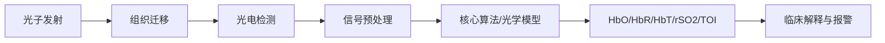
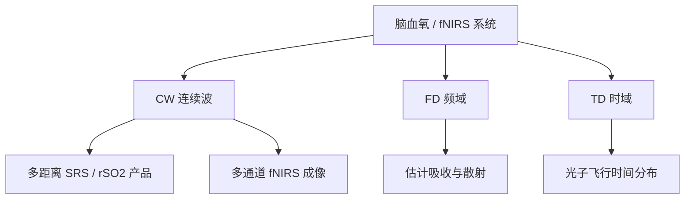
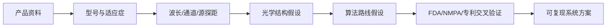
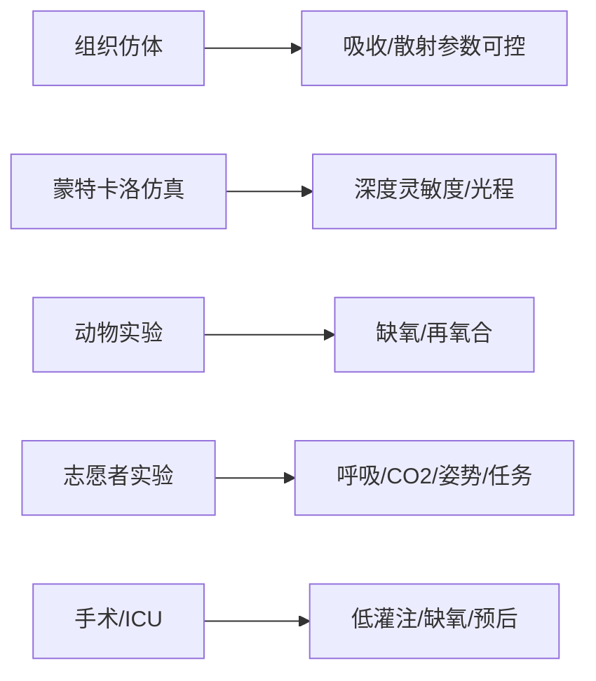
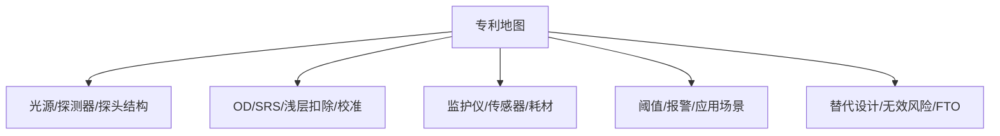

# 脑血氧监测全维度调研规划

> 本文件用于组织博士课题早期调研。涉及具体论文、专利号、FDA 510(k)、NMPA 注册信息时，必须以 PubMed、DOI、Google Patents、CNIPA、FDA、NMPA 或企业官网二次核验；不确定内容只保留检索式。

## 00 总览

核心链路：



核心枢纽笔记：

- [[脑血氧监测_NIRS_总览]]
- [[修正比尔朗伯定律_MBLL]]
- [[差分路径长度因子_DPF]]
- [[空间分辨光谱_SRS]]
- [[连续波_NIRS_CW]]
- [[频域_NIRS_FD]]
- [[时域_NIRS_TD]]
- [[短距通道回归]]
- [[脑氧监测产品矩阵]]
- [[NIRS专利地图]]
- [[脑氧监测验证体系]]

---

## 01 基本原理与数学模型

### 核心内容

[[NIRS]] / [[fNIRS]] 依赖近红外光在生物组织中的吸收与散射差异。脑血氧监测通常围绕 [[氧合血红蛋白_HbO]]、[[脱氧血红蛋白_HbR]]、总血红蛋白 HbT 与区域脑氧饱和度 rSO2 / TOI 建模。

基本光密度：

$$
OD = \ln \frac{I_0}{I}
$$

变化量：

$$
\Delta OD = \ln \frac{I(t_0)}{I(t)}
$$

[[修正比尔朗伯定律_MBLL]]：

$$
\Delta OD(\lambda)=\sum_i \varepsilon_i(\lambda)\Delta c_i \cdot L \cdot DPF(\lambda)+\Delta G
$$

其中 $L$ 是源探距，$DPF$ 是 [[差分路径长度因子_DPF]]，$\Delta G$ 表示散射与几何项变化。

### 关键技术争议或未解决问题

- CW-MBLL 简洁但主要适合相对浓度变化，绝对 rSO2 需要额外假设。
- DPF 存在年龄、脑区、波长、颅骨厚度与个体差异。
- 头皮血流、毛发、运动伪迹会污染脑源信号。
- SRS、FD、TD 更接近绝对定量，但系统成本和建模复杂度更高。

### 推荐检索式

| 检索目标 | 中文检索式 | 英文检索式 | 推荐数据库 |
|---|---|---|---|
| MBLL | 修正比尔朗伯定律 AND 近红外 AND 脑 | "modified Beer-Lambert law" AND NIRS AND brain | PubMed / Web of Science / CNKI |
| DPF | 差分路径长度因子 AND 脑 AND 近红外 | "differential pathlength factor" AND cerebral AND near infrared | PubMed / Google Scholar |
| SRS | 空间分辨光谱 AND 脑氧 | "spatially resolved spectroscopy" AND cerebral oximetry | PubMed / IEEE / Google Patents |
| FD-NIRS | 频域近红外 AND 吸收系数 AND 散射系数 | "frequency domain" AND NIRS AND absorption scattering | IEEE / Optica / PubMed |
| TD-NIRS | 时域近红外 AND 光子飞行时间 | "time domain" AND NIRS AND time-of-flight AND brain | PubMed / SPIE / Optica |

### 核心文献

- Jöbsis, F. F. (1977). *Noninvasive, infrared monitoring of cerebral and myocardial oxygen sufficiency and circulatory parameters*. Science, 198(4323), 1264–1267. DOI: `10.1126/science.929199`
- Delpy, D. T., Cope, M., van der Zee, P., Arridge, S., Wray, S., & Wyatt, J. (1988). *Estimation of optical pathlength through tissue from direct time of flight measurement*. Physics in Medicine and Biology, 33(12), 1433–1442. DOI: `10.1088/0031-9155/33/12/008`
- Patterson, M. S., Chance, B., & Wilson, B. C. (1989). *Time resolved reflectance and transmittance for the non-invasive measurement of tissue optical properties*. Applied Optics, 28(12), 2331–2336. DOI: `10.1364/AO.28.002331`
- Scholkmann, F., Kleiser, S., Metz, A. J., et al. (2014). *A review on continuous wave functional near-infrared spectroscopy and imaging instrumentation and methodology*. NeuroImage, 85, 6–27. DOI: `10.1016/j.neuroimage.2013.05.004`
- Ferrari, M., & Quaresima, V. (2012). *A brief review on the history of human functional near-infrared spectroscopy development and fields of application*. NeuroImage, 63(2), 921–935. DOI: `10.1016/j.neuroimage.2012.03.049`

> [!NOTE]
> 本维度的核心问题是：如何在强散射、多层组织、浅层污染和个体差异条件下，把光强变化映射为可信的血氧指标。

---

## 02 主流技术架构分类

### 核心内容

脑血氧监测系统可按光源调制与探测方式分为 [[连续波_NIRS_CW]]、[[频域_NIRS_FD]]、[[时域_NIRS_TD]]，也可按应用形态分为临床床旁脑氧仪、研究级 fNIRS 成像系统、可穿戴 fNIRS 系统。



### 技术路线对比

| 路线 | 测量量 | 典型输出 | 优势 | 局限 |
|---|---|---|---|---|
| CW | 光强变化 | $\Delta HbO$、$\Delta HbR$、rSO2 推算 | 成本低、体积小、产品化成熟 | 绝对定量困难，依赖 DPF 与校准 |
| CW-SRS | 多源探距光衰减斜率 | rSO2 / StO2 | 工程可实现性强，常见于临床脑氧仪 | 多层组织和散射假设仍影响结果 |
| FD | 幅度衰减 + 相位延迟 | $\mu_a$、$\mu_s'$、血氧参数 | 可估计吸收与散射 | 调制、相位测量和硬件复杂 |
| TD | 光子到达时间分布 | $\mu_a$、$\mu_s'$、深度信息 | 深度分辨能力强，绝对定量潜力高 | 成本高、系统复杂、临床普及度较低 |

### 关键技术争议或未解决问题

- CW 产品读数易受厂商算法和校准策略影响，跨设备一致性有限。
- FD/TD 理论优势明确，但小型化、低成本、临床易用性仍是瓶颈。
- 多通道 fNIRS 适合脑功能研究，但与临床脑氧仪的指标解释不同。
- 探头佩戴稳定性、毛发影响、暗环境要求与长期监测舒适性影响真实场景表现。

### 推荐检索式

| 检索目标 | 中文检索式 | 英文检索式 | 推荐数据库 |
|---|---|---|---|
| CW/FD/TD 对比 | 连续波 频域 时域 近红外 光谱 对比 | CW FD TD NIRS comparison cerebral oximetry | PubMed / Web of Science |
| 临床脑氧仪架构 | 脑氧仪 源探距 波长 探头 | cerebral oximeter wavelength source detector distance | FDA / PubMed / 厂商官网 |
| 可穿戴 fNIRS | 可穿戴 功能近红外 多通道 | wearable fNIRS system multichannel | IEEE / PubMed |
| FD 定量 | 频域近红外 组织光学参数 | frequency-domain NIRS tissue optical properties | Optica / IEEE |
| TD 定量 | 时域近红外 深度分辨 | time-domain NIRS depth sensitivity brain | PubMed / SPIE |

### 核心文献与资料入口

- Scholkmann et al. (2014). NeuroImage. DOI: `10.1016/j.neuroimage.2013.05.004`
- Ferrari & Quaresima (2012). NeuroImage. DOI: `10.1016/j.neuroimage.2012.03.049`
- Patterson, Chance & Wilson (1989). Applied Optics. DOI: `10.1364/AO.28.002331`
- 检索式替代：`"cerebral oximeter" AND "source-detector distance" AND wavelength`
- 检索式替代：`"frequency domain near infrared spectroscopy" AND tissue oximetry review`

> [!NOTE]
> 本维度的核心争议是工程可用性与物理定量能力的取舍：CW 最容易产品化，FD/TD 更接近绝对定量，但硬件复杂度和临床可部署性更高。

---

## 03 代表性产品深度解剖

### 核心内容

本维度围绕国际标杆与国内头部产品建立 [[脑氧监测产品矩阵]]，目标不是只列参数，而是反推其技术路线、硬件约束、算法假设、临床定位与知识产权壁垒。

### 国际产品初步分类

| 产品/厂商 | 技术路线初判 | 典型定位 | 重点关注点 |
|---|---|---|---|
| [[CASMED_FORE-SIGHT]] | CW / 多距离 SRS 类 | 临床脑氧监测 | 绝对 rSO2 标称、探头设计、校准模型 |
| [[Medtronic_INVOS_5100C]] | CW / SRS 类 | 临床脑氧监测 | rSO2 输出、FDA 文件、长期临床文献 |
| [[Masimo_O3]] | CW / 多波长多距离类 | 临床脑氧监测 | 与 Root 平台集成、传感器设计 |
| [[NONIN_EQUANOX]] | CW / 多距离类 | 临床脑氧监测 | 双发射/双探测结构、专利路线 |
| [[Hamamatsu_NIRO]] | 多型号，部分支持 SRS / TD 研究路线 | 临床/研究 | TOI、nTHI、时间分辨型号 |
| [[ISS_Imagent]] | FD-NIRS | 研究级脑功能成像 | 频域调制、相位测量 |
| [[NIRx]] / [[Artinis]] | 多通道 fNIRS | 神经科学研究/可穿戴 | 多通道布局、软件生态、实验范式 |

### 国内产品初步分类

| 企业 | 技术路线初判 | 重点关注点 | 说明 |
|---|---|---|---|
| [[慧创医疗]] | fNIRS / 多通道脑功能成像 | 设备型号、注册证、软件分析平台、公开专利 | [基于公开资料分析/推测] |
| [[中科搏锐]] | 脑功能 / 脑血氧相关近红外系统 | 中科院自动化所背景、注册与专利、产品应用场景 | [基于公开资料分析/推测] |

### 逆向工程拆解模板



### 关键技术争议或未解决问题

- 厂商 rSO2 / TOI 定义不完全一致，读数不可简单横向等价。
- 公开资料通常不披露完整算法、校准样本、权重模型。
- 同一产品线不同代际硬件和探头可能存在差异。
- 国内产品的底层算法与核心专利需要以公开专利和注册资料核验，不能从宣传材料直接推断。

### 推荐检索式

| 检索目标 | 中文检索式 | 英文检索式 | 推荐数据库 |
|---|---|---|---|
| INVOS 注册文件 | INVOS 5100C FDA 510(k) | "INVOS 5100C" "510(k)" cerebral oximeter | FDA 510(k) / Google |
| FORE-SIGHT | FORE-SIGHT cerebral oximeter sensor SRS | "FORE-SIGHT" cerebral oximeter "absolute" rSO2 | FDA / PubMed / Google Patents |
| Masimo O3 | Masimo O3 脑氧 FDA | "Masimo O3" cerebral oximetry "510(k)" | FDA / 厂商官网 / Google Patents |
| EQUANOX | NONIN EQUANOX cerebral oximeter | "EQUANOX" cerebral oximeter patent | FDA / Google Patents |
| Hamamatsu NIRO | Hamamatsu NIRO TOI time resolved | "Hamamatsu NIRO" "tissue oxygenation index" | PubMed / 厂商官网 |
| ISS Imagent | ISS Imagent frequency domain NIRS | "ISS Imagent" frequency-domain NIRS | IEEE / PubMed |
| 慧创医疗 | 慧创医疗 功能近红外 注册证 专利 | Huichuang fNIRS patent registration | NMPA / CNIPA / 官网 |
| 中科搏锐 | 中科搏锐 近红外 脑功能 专利 | Zhongke Borui fNIRS patent | NMPA / CNIPA / 官网 |

### 公司核心专利与知识产权

#### CASMED / FORE-SIGHT

### 核心专利与知识产权

- 不直接列专利号，先用检索式核验：`assignee:(CAS Medical Systems) AND cerebral oximetry AND near infrared`
- 重点看权利要求是否覆盖：多距离探头、绝对脑氧、校准模型、传感器结构。

#### Medtronic / INVOS

### 核心专利与知识产权

- 检索式：`assignee:(Somanetics OR Covidien OR Medtronic) AND INVOS AND cerebral oximetry`
- 重点看 Somanetics 早期专利族、传感器结构、rSO2 算法、双探测距离设计。

#### Masimo / O3

### 核心专利与知识产权

- 检索式：`assignee:(Masimo) AND cerebral oximetry AND near infrared`
- 重点看多波长、多距离、传感器与监护平台集成。

#### NONIN / EQUANOX

### 核心专利与知识产权

- 检索式：`assignee:(Nonin) AND EQUANOX AND cerebral oximetry`
- 重点看双发射/双探测、浅层扣除、组织氧合算法。

#### Hamamatsu / NIRO

### 核心专利与知识产权

- 检索式：`assignee:(Hamamatsu) AND near infrared spectroscopy AND tissue oxygenation`
- 重点看 TD 检测、TOI 输出、光子计数与探头结构。

#### ISS / Imagent

### 核心专利与知识产权

- 检索式：`assignee:(ISS) AND frequency domain AND near infrared spectroscopy`
- 重点看频域调制、相位检测、多通道成像。

#### 慧创医疗

### 核心专利与知识产权

- [基于公开资料分析/推测] 检索式：`申请人=(慧创医疗) AND (功能近红外 OR 脑功能 OR 近红外)`
- 核验数据库：CNIPA、国家知识产权局、中国及多国专利审查信息查询、NMPA。

#### 中科搏锐

### 核心专利与知识产权

- [基于公开资料分析/推测] 检索式：`申请人=(中科搏锐 OR 中国科学院自动化研究所) AND (近红外 OR 脑功能 OR 脑氧)`
- 核验数据库：CNIPA、NMPA、企业官网、中科院自动化所公开成果。

> [!NOTE]
> 本维度的核心问题是“产品读数背后的模型不可见”。竞品分析必须把产品说明、FDA/NMPA 文件、论文、专利四类证据交叉验证，不能从宣传指标直接推断算法细节。

---

## 04 核心算法与信号处理链路

### 核心内容

算法链路从原始光强开始，经过同步、暗电流扣除、运动伪迹处理、光密度转换、浅层回归、血红蛋白反演，最后输出 $\Delta HbO$、$\Delta HbR$、HbT、rSO2 或任务相关激活图。

```mermaid
flowchart TB
Raw[原始光强 I(t)] --> QC[质量控制/饱和检测]
QC --> Dark[暗电流/环境光扣除]
Dark --> Filter[滤波与漂移去除]
Filter --> Motion[运动伪迹校正]
Motion --> OD[OD 转换]
OD --> SSR[短距通道回归]
SSR --> MBLL[MBLL/SRS/FD/TD 反演]
MBLL --> Hb[HbO/HbR/HbT/rSO2]
Hb --> Clinical[临床阈值/趋势/报警]
```

OD 转换：

$$
\Delta OD(t,\lambda)=\ln\frac{I(t_0,\lambda)}{I(t,\lambda)}
$$

短距通道回归：

$$
y_{long}(t)=\beta_0+\beta_1 y_{short}(t)+\epsilon(t)
$$

残差 $\epsilon(t)$ 可作为去除浅层成分后的脑源信号近似。

### 关键技术争议或未解决问题

- 运动伪迹处理可能同时去除真实生理成分。
- 短距通道回归依赖短距通道质量和浅层代表性。
- 临床脑氧仪通常输出平滑趋势，实时性与鲁棒性优先于高时间分辨率。
- 动静脉权重、浅层扣除、个体化校准是 rSO2 算法黑箱的核心。

### 推荐检索式

| 检索目标 | 中文检索式 | 英文检索式 | 推荐数据库 |
|---|---|---|---|
| OD 转换 | 光密度 转换 功能近红外 | optical density conversion fNIRS | PubMed / Neurophotonics |
| 短距回归 | 短距通道 回归 功能近红外 | short-separation regression fNIRS | PubMed / NeuroImage |
| 运动伪迹 | 功能近红外 运动伪迹 小波 | fNIRS motion artifact wavelet spline | PubMed / IEEE |
| 生理噪声 | 功能近红外 生理噪声 心率 呼吸 | fNIRS physiological noise heart respiration | PubMed |
| GLM | 功能近红外 广义线性模型 | fNIRS general linear model GLM | PubMed / MNE-NIRS 文档 |

### 核心文献与检索入口

- 检索式：`"short-separation regression" AND fNIRS AND superficial signal`
- 检索式：`"motion artifact correction" AND fNIRS AND wavelet`
- 检索式：`"fNIRS signal processing" AND "optical density" AND "modified Beer-Lambert"`
- 推荐工具链：[[Homer3]]、[[MNE-NIRS]]、[[NIRS Brain AnalyzIR Toolbox]]、[[NIRS-SPM]]

> [!NOTE]
> 本维度的核心争议是“信号清洗是否改变生理解释”。算法不是越复杂越好，临床监测更关注趋势稳定、伪迹鲁棒和误报警控制。

---

## 05 校准与验证体系

### 核心内容

脑血氧监测验证体系包括物理仿体、蒙特卡洛仿真、动物实验、健康志愿者生理挑战、临床场景对比，以及与血气、SjvO2、PET、MRI 等参照方法的比较。



组织仿体通常需要控制：

$$
\mu_a,\quad \mu_s',\quad g,\quad n
$$

其中 $\mu_a$ 是吸收系数，$\mu_s'$ 是约化散射系数，$g$ 是各向异性因子，$n$ 是折射率。

### 关键技术争议或未解决问题

- 脑氧 rSO2 没有单一完美金标准。
- SjvO2 是全脑静脉氧合，NIRS 是局部混合组织氧合，空间尺度不同。
- 脉搏血氧 SpO2 主要反映动脉血氧，不能直接作为脑组织氧合金标准。
- 组织仿体可控但不代表真实头部多层结构。
- 蒙特卡洛仿真依赖组织参数设定，模型可信度取决于输入参数。

### 推荐检索式

| 检索目标 | 中文检索式 | 英文检索式 | 推荐数据库 |
|---|---|---|---|
| 金标准争议 | 脑氧饱和度 金标准 近红外 | cerebral oximetry gold standard NIRS | PubMed |
| 组织仿体 | 近红外 组织仿体 吸收 散射 | NIRS tissue phantom absorption scattering | PubMed / SPIE |
| 蒙特卡洛 | 蒙特卡洛 近红外 头模型 | Monte Carlo NIRS head model cerebral oximetry | PubMed / MCX 文档 |
| 临床验证 | 脑氧仪 临床验证 心脏手术 | cerebral oximetry validation cardiac surgery | PubMed |
| 低氧挑战 | 近红外 脑氧 低氧 挑战 | cerebral oximetry hypoxia challenge NIRS | PubMed |

### 核心文献与检索入口

- 检索式：`"cerebral oximetry" AND validation AND "jugular venous oxygen saturation"`
- 检索式：`"near infrared spectroscopy" AND "tissue phantom" AND optical properties`
- 检索式：`"Monte Carlo" AND "near-infrared spectroscopy" AND adult head model`
- 工具入口：[[MCX_Monte_Carlo_eXtreme]]、[[NIRFAST]]、[[ValoMC]]

> [!NOTE]
> 本维度的核心争议是“验证对象是否等价”。脑氧仪测的是局部混合组织氧合，任何参照标准都只能部分对应，必须明确空间尺度、血管成分和时间响应差异。

---

## 06 专利与知识产权布局

### 核心内容

专利调研目标是建立 [[NIRS专利地图]]，识别国际厂商与国内企业在传感器结构、源探距、多波长算法、浅层扣除、校准模型、报警逻辑、可穿戴结构上的保护范围。



### 专利分析步骤

1. 确定申请人及历史实体：公司并购、产品线迁移、子公司名称。
2. 检索专利族：优先权、同族国家、法律状态、失效日期。
3. 拆权利要求：独立权利要求覆盖对象、必要技术特征、可规避点。
4. 映射产品：产品说明书、FDA/NMPA 文件与专利附图交叉验证。
5. 输出 FTO 草图：哪些路线高风险，哪些替代设计可探索。

### 关键技术争议或未解决问题

- 专利文本常故意宽泛，不等于产品实际算法。
- 公开专利不代表仍有效，需要查法律状态。
- 国内企业可能存在未公开或未授权申请，不能仅凭公开专利判断全部能力。
- 规避设计需要同时考虑专利、注册、临床可靠性和工程实现。

### 推荐检索式

| 检索目标 | 中文检索式 | 英文检索式 | 推荐数据库 |
|---|---|---|---|
| 国际脑氧专利 | 脑氧 近红外 探头 专利 | cerebral oximetry near infrared sensor patent | Google Patents / Espacenet |
| INVOS 专利 | Somanetics INVOS 脑氧 专利 | Somanetics INVOS cerebral oximetry patent | Google Patents / USPTO |
| FORE-SIGHT 专利 | CASMED FORE-SIGHT 脑氧 专利 | CAS Medical FORE-SIGHT cerebral oximetry patent | Google Patents |
| Masimo O3 专利 | Masimo O3 脑氧 专利 | Masimo O3 cerebral oximetry patent | Google Patents |
| 国内近红外专利 | 功能近红外 脑功能 申请人 慧创 | 慧创医疗 功能近红外 专利 | CNIPA |
| 中科相关专利 | 中科搏锐 近红外 脑功能 专利 | 中国科学院自动化研究所 近红外 脑功能 专利 | CNIPA |

### 公司核心专利与知识产权

#### Medtronic / Somanetics / Covidien

### 核心专利与知识产权

- 检索入口：`assignee:(Somanetics OR Covidien OR Medtronic) AND "cerebral oximetry"`
- 分析重点：rSO2 算法、双距离传感器、浅层扣除、耗材结构。

#### CASMED / Edwards / FORE-SIGHT

### 核心专利与知识产权

- 检索入口：`assignee:("CAS Medical Systems" OR Edwards) AND "FORE-SIGHT" AND oximetry`
- 分析重点：绝对脑氧、SRS、多距离探头、成人/儿童传感器。

#### Masimo

### 核心专利与知识产权

- 检索入口：`assignee:(Masimo) AND ("cerebral oximetry" OR "regional oxygen saturation")`
- 分析重点：多波长、多传感器、平台集成、报警与趋势算法。

#### Nonin

### 核心专利与知识产权

- 检索入口：`assignee:(Nonin) AND ("cerebral oximetry" OR EQUANOX)`
- 分析重点：传感器几何、双发射/双接收、组织氧饱和度估计。

#### Hamamatsu

### 核心专利与知识产权

- 检索入口：`assignee:(Hamamatsu) AND ("time-resolved" OR "near infrared spectroscopy")`
- 分析重点：TD 检测、光子计数、TOI 相关实现。

#### 慧创医疗

### 核心专利与知识产权

- [基于公开资料分析/推测] 检索入口：`申请人=(慧创医疗) AND (功能近红外 OR 近红外 OR 脑功能)`
- 分析重点：多通道布局、佩戴结构、脑功能软件、数据处理方法。

#### 中科搏锐

### 核心专利与知识产权

- [基于公开资料分析/推测] 检索入口：`申请人=(中科搏锐 OR 中国科学院自动化研究所) AND (近红外 OR 脑功能 OR 脑氧)`
- 分析重点：科研转化路径、系统架构、算法软件、临床/科研应用边界。

> [!NOTE]
> 本维度的核心争议是“专利披露与真实产品实现之间存在距离”。专利地图应服务于研发选型和规避设计，而不是替代工程验证。

---

## 07 学术研究前沿与未解问题

### 核心内容

前沿问题集中在绝对定量、深度分辨、个体化建模、可穿戴系统、低功耗硬件、复杂场景鲁棒性、多模态融合与临床有效性证据。

### 重点方向

| 方向 | 研究问题 | 潜在课题切入 |
|---|---|---|
| 绝对测量 | rSO2 是否可跨个体、跨设备比较 | 个体化 DPF / 多层头模型 |
| 深度分辨 | 如何区分头皮与脑皮层贡献 | TD / 多距离 / 短距回归 / 蒙特卡洛 |
| 小型化 | 如何降低功耗、体积和成本 | LED/PD 阵列、AFE、边缘算法 |
| 可穿戴 fNIRS | 如何保证长期佩戴稳定 | 机械结构、光耦合质量监测 |
| 算法鲁棒性 | 如何处理运动与生理噪声 | 自适应滤波、贝叶斯模型、深度学习 |
| 多模态融合 | 如何结合 EEG、SpO2、血压、MRI | 多模态状态估计 |
| 临床证据 | rSO2 改变是否改善结局 | 前瞻性临床研究设计 |

### 关键技术争议或未解决问题

- 绝对脑氧测量在真实头部结构中仍存在模型误差。
- 深度灵敏度不是单一固定值，而由源探距、波长、组织参数共同决定。
- 深度学习方法可能提高预测，但可解释性和跨设备泛化不足。
- 可穿戴 fNIRS 的便携性与信号质量存在天然张力。
- 临床脑氧监测的阈值策略、干预策略和结局改善仍需强证据。

### 推荐检索式

| 检索目标 | 中文检索式 | 英文检索式 | 推荐数据库 |
|---|---|---|---|
| 绝对脑氧 | 绝对 脑氧饱和度 近红外 个体差异 | absolute cerebral oxygen saturation NIRS individual variability | PubMed |
| 个体化头模型 | 个体化 头模型 近红外 蒙特卡洛 | individualized head model Monte Carlo fNIRS | PubMed / Web of Science |
| 可穿戴 fNIRS | 可穿戴 功能近红外 长期监测 | wearable fNIRS long-term monitoring | IEEE / PubMed |
| 深度学习 | 深度学习 功能近红外 伪迹 去除 | deep learning fNIRS motion artifact removal | IEEE / PubMed |
| 多模态融合 | EEG fNIRS 融合 脑功能 | EEG fNIRS multimodal fusion brain monitoring | PubMed / IEEE |
| 临床结局 | 脑氧监测 干预 临床结局 | cerebral oximetry intervention clinical outcome | PubMed / Cochrane |

### 核心文献与资料入口

- 检索式：`"individualized head model" AND fNIRS AND Monte Carlo`
- 检索式：`"wearable fNIRS" AND "signal quality" AND review`
- 检索式：`"cerebral oximetry" AND "clinical outcomes" AND randomized`
- 检索式：`"deep learning" AND fNIRS AND "motion artifact"`

### 博士课题候选切入点

1. **个体化光程与 DPF 估计**：结合头围、MRI/CT 模板或多距离数据修正 MBLL。
2. **浅层污染建模**：短距通道、ICA、贝叶斯回归与多层蒙特卡洛联合。
3. **低成本 SRS 原型系统**：基于多距离探头和校准仿体建立可复现实验平台。
4. **临床脑氧指标一致性研究**：比较不同算法定义下 rSO2 / TOI 的可比性。
5. **可穿戴 fNIRS 鲁棒性**：光耦合质量检测、运动补偿和实时质量评分。

> [!NOTE]
> 本维度的核心未解问题是：如何让脑血氧监测从“趋势可用”走向“个体可信、跨设备可比、临床可解释”。博士课题应尽量选择可验证、可复现、可落地的子问题。

---

## 08 后续执行清单

- 建立 [[脑血氧监测产品矩阵]]，每个产品单独建笔记。
- 建立 [[NIRS专利地图]]，先只记录检索式和已核验专利族。
- 建立 [[脑氧监测验证体系]]，区分仿体、仿真、动物、人体、临床证据。
- 建立 [[NIRS核心文献库]]，所有论文统一记录 DOI、PMID、摘要、贡献、局限。
- 所有未核验信息标记 `#NIRS/待验证`。

