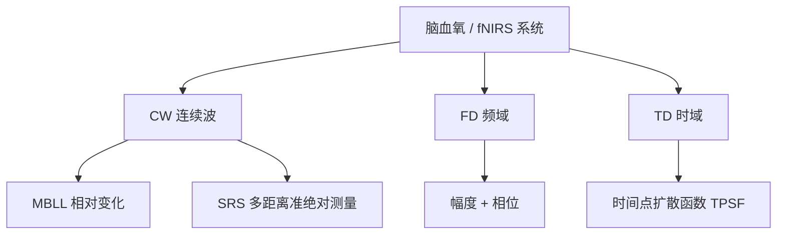
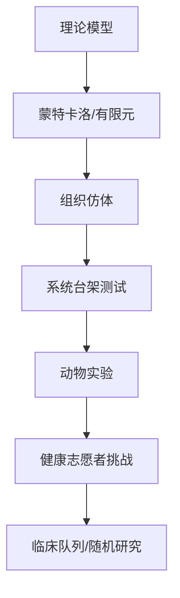
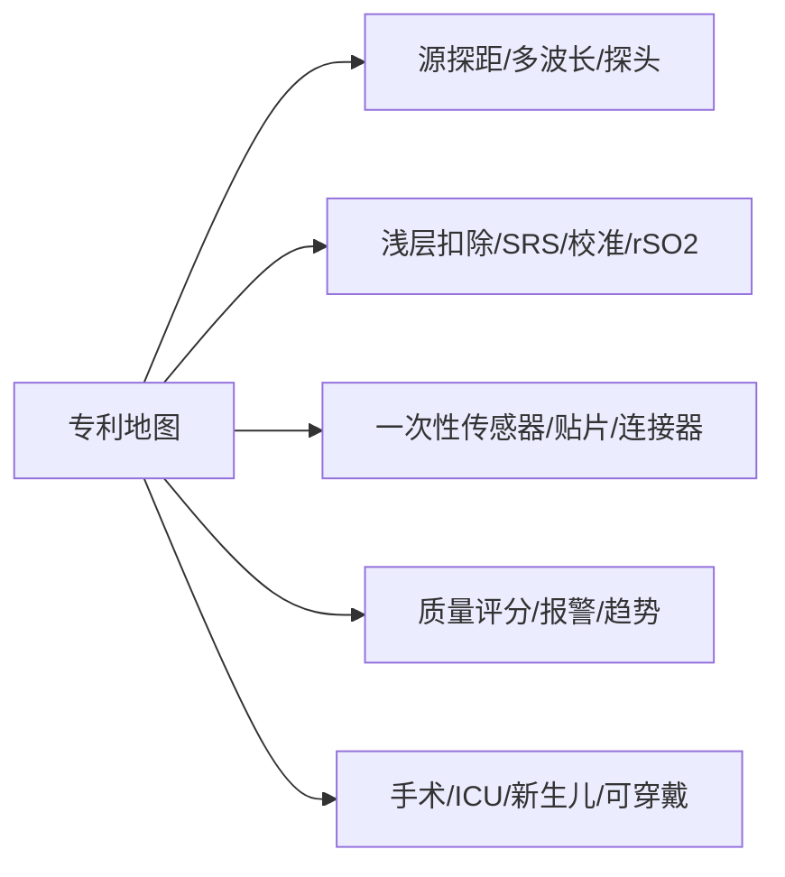
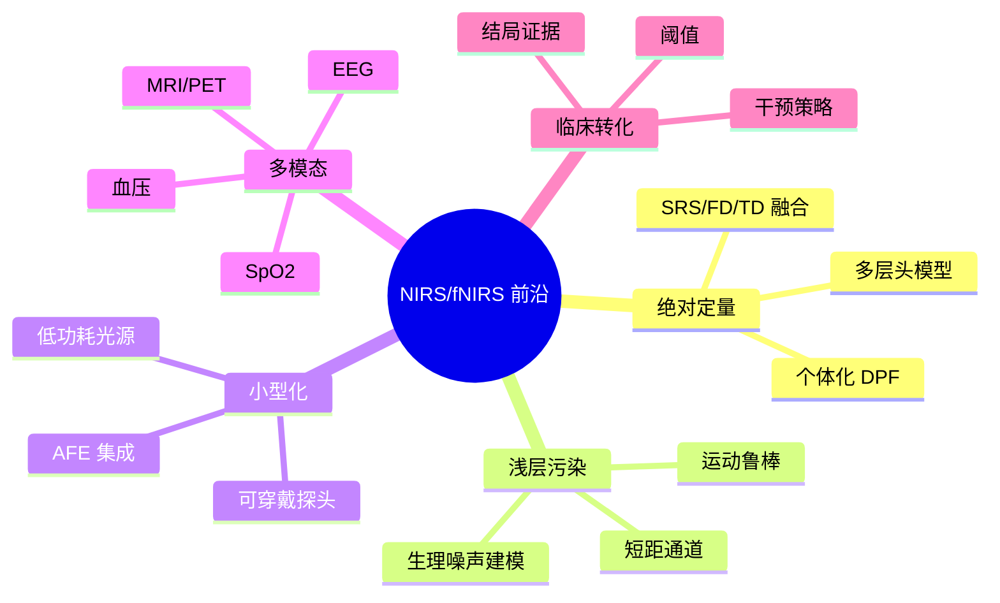

# 脑血氧监测系统详细调研报告

> 本报告按 [[00_脑血氧监测全维度调研规划]] 展开。涉及论文、专利、FDA/NMPA 注册、厂商产品细节时，原则上只写可由公开资料交叉核验的信息；尚未核验的企业算法、专利族和注册编号均以检索式或 `[基于公开资料分析/推测]` 标注。

## 导航栏

| 模块 | 快速跳转 | 用途 |
|---|---|---|
| 资料权限 | [[01_脑血氧监测系统详细调研报告#0. 账号认证与资料可得性]] | 判断是否需要学校 VPN、期刊账号或专利数据库 |
| 基本原理 | [[01_脑血氧监测系统详细调研报告#1. 基本原理与数学模型]] | MBLL、DPF、SRS、FD、TD 的基础模型 |
| 技术架构 | [[01_脑血氧监测系统详细调研报告#2. 主流技术架构分类]] | CW/FD/TD、硬件模块、工程指标 |
| 产品竞品 | [[01_脑血氧监测系统详细调研报告#3. 代表性产品深度解剖]] | 国际/国内产品、逆向工程框架 |
| 信号算法 | [[01_脑血氧监测系统详细调研报告#4. 核心算法与信号处理链路]] | OD、运动伪迹、短距回归、临床算法 |
| 校准验证 | [[01_脑血氧监测系统详细调研报告#5. 校准与验证体系]] | 仿体、蒙特卡洛、金标准、临床验证 |
| 专利布局 | [[01_脑血氧监测系统详细调研报告#6. 专利与知识产权布局]] | 专利地图、公司检索式、中科搏锐分析 |
| 学术前沿 | [[01_脑血氧监测系统详细调研报告#7. 学术前沿与博士课题切入点]] | 未解问题、博士课题候选方向 |
| 执行计划 | [[01_脑血氧监测系统详细调研报告#8. 建议的下一步执行计划]] | 一周、一个月、三个月行动计划 |
| 参考入口 | [[01_脑血氧监测系统详细调研报告#9. 参考与核验入口]] | DOI、FDA、CNIPA、厂商官网入口 |

### 常用专题入口

| 专题 | 跳转 |
|---|---|
| 本地论文精读补充 | [[01_脑血氧监测系统详细调研报告#1.8 本地论文精读补充]] |
| 架构分类论文补充 | [[01_脑血氧监测系统详细调研报告#2.5 本地论文对架构分类的补充]] |
| INVOS 专利支撑 | [[01_脑血氧监测系统详细调研报告#6.5 INVOS 本地专利分析]] |
| 中科搏锐产品与专利 | [[01_脑血氧监测系统详细调研报告#中科搏锐]] |
| 中科搏锐本地专利分析 | [[01_脑血氧监测系统详细调研报告#6.6 中科搏锐本地专利分析]] |
| 验证体系论文补充 | [[01_脑血氧监测系统详细调研报告#5.4 本地论文对验证体系的补充]] |
| 前沿判断论文补充 | [[01_脑血氧监测系统详细调研报告#7.2 本地论文对前沿判断的补充]] |

---

## 0. 账号认证与资料可得性

当前阶段可先使用公开资料完成 70%–80% 的早期调研，不一定需要期刊账号。

可能需要账号或机构权限的资料：

- 期刊全文：部分 Elsevier、Springer、IEEE、SPIE、Optica 论文可能需要学校 VPN / 图书馆账号。
- 标准文件：IEC、ISO、YY/T、GB/T 标准通常需要购买或通过学校数据库访问。
- 商业数据库：Derwent、Incopat、智慧芽、PatSnap、医械数据平台可能需要账号。
- 厂商 IFU / Service Manual：部分说明书可公开下载，维修手册、算法白皮书通常不公开。

优先公开入口：

- PubMed: <https://pubmed.ncbi.nlm.nih.gov/>
- Google Scholar: <https://scholar.google.com/>
- FDA 510(k): <https://www.accessdata.fda.gov/scripts/cdrh/cfdocs/cfpmn/pmn.cfm>
- openFDA 510(k) API: <https://open.fda.gov/apis/device/510k/>
- Google Patents: <https://patents.google.com/>
- Espacenet: <https://worldwide.espacenet.com/>
- CNIPA: <https://pss-system.cponline.cnipa.gov.cn/>
- NMPA: <https://www.nmpa.gov.cn/>

---

## 1. 基本原理与数学模型

### 1.1 测量对象

[[脑血氧监测_NIRS_总览]] 的目标不是直接“拍到血氧”，而是通过近红外光在组织中的吸收、散射和出射光变化，反推出与血红蛋白相关的光学参数。主要生理量包括：

- [[氧合血红蛋白_HbO]]：反映氧合状态和局部血流供给。
- [[脱氧血红蛋白_HbR]]：反映氧提取和局部代谢活动。
- HbT：$HbT = HbO + HbR$，常被视为局部血容量变化近似。
- rSO2 / TOI / StO2：不同厂商或研究系统输出的局部组织氧饱和度指标。

临床脑氧与 fNIRS 常用光谱窗口约为 650–950 nm；更宽泛的组织“治疗窗口”常写作 600–1000 nm 或 700–1300 nm。该区间内水吸收相对较低，HbO 与 HbR 的吸收谱差异可用于反演浓度变化。早期文献还讨论细胞色素氧化酶 $aa_3$ 的近红外吸收，但其信号弱、交叉敏感性高，现代临床脑氧仪不宜把它与 HbO/HbR 信号混作同一类解释。

### 1.2 光密度与 OD 转换

原始探测信号通常为光电二极管或 APD 输出的电流/电压，经 ADC 转换为数字光强 $I(t)$。

$$
OD = \ln \frac{I_0}{I}
$$

实际 fNIRS / CW-NIRS 中更常使用变化量：

$$
\Delta OD(t,\lambda)=\ln \frac{I(t_0,\lambda)}{I(t,\lambda)}
$$

该转换把光强衰减转为近似线性可加的吸收变化，为后续 [[修正比尔朗伯定律_MBLL]] 反演打基础。

### 1.3 MBLL

经典比尔朗伯定律适用于低散射均匀介质：

$$
A = \varepsilon c L
$$

脑组织是强散射介质，因此需要引入 [[差分路径长度因子_DPF]] 和散射几何项：

$$
\Delta OD(\lambda)=\sum_i \varepsilon_i(\lambda)\Delta c_i \cdot L \cdot DPF(\lambda)+\Delta G
$$

其中：

- $\varepsilon_i(\lambda)$：第 $i$ 种色团在波长 $\lambda$ 下的摩尔消光系数。
- $\Delta c_i$：浓度变化。
- $L$：源探距。
- $DPF(\lambda)$：实际平均光程与源探距之比。
- $\Delta G$：散射和几何项变化。

这里的 $DPF$ 不是固定常数。Delpy 等的飞行时间测量说明强散射组织内光程显著长于几何源探距；Hiraoka 等进一步把 MBLL 推广到非均质介质，引入 partial differential pathlength，用来描述头皮、颅骨、脑脊液和脑组织各层对总 NIRS 信号的贡献。Scholkmann 和 Wolf 后续给出额叶 DPF 的年龄—波长经验方程，提示工程系统至少应把 $DPF$ 视为 $DPF(\lambda, age)$，更严谨时还应考虑头部区域和组织层结构。

在双波长、双血红蛋白模型下：

$$
\begin{bmatrix}
\Delta OD(\lambda_1) \\
\Delta OD(\lambda_2)
\end{bmatrix}
=
L
\begin{bmatrix}
\varepsilon_{HbO}(\lambda_1)DPF(\lambda_1) & \varepsilon_{HbR}(\lambda_1)DPF(\lambda_1) \\
\varepsilon_{HbO}(\lambda_2)DPF(\lambda_2) & \varepsilon_{HbR}(\lambda_2)DPF(\lambda_2)
\end{bmatrix}
\begin{bmatrix}
\Delta HbO \\
\Delta HbR
\end{bmatrix}
$$

### 1.4 SRS

[[空间分辨光谱_SRS]] 使用多个源探距的衰减斜率估计组织吸收特性。直觉上，若不同探测距离处的光强衰减随距离变化具有稳定斜率，则该斜率与吸收、散射参数相关。

$$
\frac{\partial A(\rho)}{\partial \rho} \rightarrow \mu_a,\mu_s'
$$

SRS 常见于临床脑氧监测产品，因为它比单距离 CW 更适合估计绝对或准绝对组织氧合。以 Hamamatsu NIRO-300 的公开论文为例，系统通过 SRS 输出 TOI：

$$
TOI=\frac{HbO}{HbO+HbR}
$$

其验证路径包括血液/Intralipid 仿体与血气分析仪对比，以及人体前臂与 TRS 系统同步测量。该证据支持 SRS 可作为床旁组织氧合指数方案，但其准确性仍受多层组织结构、源探距、扩散模型和厂商校准影响。

### 1.5 FD 与 TD

[[频域_NIRS_FD]] 使用调制光：

$$
I(t)=I_0[1+m\cos(\omega t)]
$$

组织传播后，检测幅值衰减和相位延迟：

$$
\Delta \phi = f(\mu_a,\mu_s')
$$

更完整地说，FD-NIRS 同时利用 DC 光强、AC 调制幅度和相位：

$$
S_{FD}=DC+ACe^{i\phi}e^{-i\omega t}
$$

相位信息提高了对 $\mu_a$、$\mu_s'$ 和深层脑组织的可辨识度，但代价是调制源、相敏检测和标定复杂度显著上升。

[[时域_NIRS_TD]] 使用短脉冲光并记录光子飞行时间分布：

$$
TPSF(t)=P(t|\mu_a,\mu_s')
$$

TD 的优势是深度信息更丰富；晚到达光子平均路径更长，对深层组织更敏感。2019 年 TD-NIRS 临床脑监测综述把其优势概括为：可估计绝对 Hb 浓度和组织氧饱和度、可同时得到约化散射系数、可增强脑组织相对于颅外组织的特异性。但系统通常需要脉冲激光、TCSPC 或高速探测器，成本、体积、采样率和操作复杂度仍限制了临床普及。

### 1.6 关键争议

- **绝对值争议**：CW-MBLL 通常适合相对变化；绝对 rSO2 依赖模型、校准和先验。
- **DPF 个体差异**：固定 DPF 不足以描述年龄、头围、颅骨厚度、脑区和波长差异。
- **浅层污染**：头皮血流变化可显著影响长距通道。
- **多层组织建模**：真实头部不是均匀半无限介质，成人额叶测量尤其受头皮、颅骨和脑脊液影响。
- **色团交叉敏感性**：HbO、HbR、细胞色素氧化酶和散射变化在有限波长数下可能互相串扰；临床报告应优先解释血红蛋白相关指标，谨慎解释细胞色素氧化酶。

### 1.7 文献与检索式

| 检索目标 | 中文检索式                   | 英文检索式                                                      | 推荐数据库                          |
| ---- | ----------------------- | ---------------------------------------------------------- | ------------------------------ |
| MBLL | 修正比尔朗伯定律 AND 近红外 AND 脑  | "modified Beer-Lambert law" AND NIRS AND brain             | PubMed / Web of Science / CNKI |
| DPF  | 差分路径长度因子 AND 近红外 AND 年龄 | "differential pathlength factor" AND age AND near infrared | PubMed / Google Scholar        |
| SRS  | 空间分辨光谱 AND 脑氧           | "spatially resolved spectroscopy" AND cerebral oximetry    | PubMed / Google Patents        |
| FD   | 频域近红外 AND 相位 AND 吸收散射   | "frequency domain" AND NIRS AND phase AND scattering       | IEEE / Optica                  |
| TD   | 时域近红外 AND 光子飞行时间 AND 脑  | "time domain" AND NIRS AND time-of-flight AND brain        | PubMed / SPIE                  |

核心文献：

- Jöbsis, F. F. (1977). *Noninvasive, infrared monitoring of cerebral and myocardial oxygen sufficiency and circulatory parameters*. Science, 198(4323), 1264–1267. DOI: `10.1126/science.929199`
- Delpy, D. T., Cope, M., van der Zee, P., Arridge, S., Wray, S., & Wyatt, J. (1988). *Estimation of optical pathlength through tissue from direct time of flight measurement*. Physics in Medicine and Biology, 33(12), 1433–1442. DOI: `10.1088/0031-9155/33/12/008`
- Cope, M., & Delpy, D. T. (1988). *A system for long-term measurement of cerebral blood and tissue oxygenation in newborn infants by near infra-red transillumination*. Medical & Biological Engineering & Computing, 26, 289–294.
- Patterson, M. S., Chance, B., & Wilson, B. C. (1989). *Time resolved reflectance and transmittance for the non-invasive measurement of tissue optical properties*. Applied Optics, 28(12), 2331–2336. DOI: `10.1364/AO.28.002331`
- Hiraoka, M., Firbank, M., Essenpreis, M., Cope, M., Arridge, S. R., van der Zee, P., & Delpy, D. T. (1993). *A Monte Carlo investigation of optical pathlength in inhomogeneous tissue and its application to near-infrared spectroscopy*. Physics in Medicine and Biology, 38(12), 1859–1876.
- Suzuki, S., Takasaki, S., Ozaki, T., & Kobayashi, Y. (2003). *A tissue oxygenation monitor using NIR spatially resolved spectroscopy*. Proceedings of SPIE.
- Scholkmann, F., & Wolf, M. (2013). *General equation for the differential pathlength factor of the frontal human head depending on wavelength and age*. Journal of Biomedical Optics, 18(10), 105004.
- Scholkmann, F., Kleiser, S., Metz, A. J., et al. (2014). *A review on continuous wave functional near-infrared spectroscopy and imaging instrumentation and methodology*. NeuroImage, 85, 6–27. DOI: `10.1016/j.neuroimage.2013.05.004`
- Lange, F., & Tachtsidis, I. (2019). *Clinical brain monitoring with time domain NIRS: A review and future perspectives*. Applied Sciences, 9(8), 1612.
- Fantini, S., & Sassaroli, A. (2020). *Frequency-domain techniques for cerebral and functional near-infrared spectroscopy*. Frontiers in Neuroscience, 14, 300. DOI: `10.3389/fnins.2020.00300`
- Ferrari, M., & Quaresima, V. (2012). *A brief review on the history of human functional near-infrared spectroscopy development and fields of application*. NeuroImage, 63(2), 921–935. DOI: `10.1016/j.neuroimage.2012.03.049`

### 1.8 本地论文精读补充

基于 `paper/` 目录下已读核心论文，可补充以下判断：

- [[Jöbsis_1977_NIRS起点]]：Jöbsis 证明 700–1300 nm 近红外窗口内，生物组织仍允许足够光子穿透，可连续、非侵入式记录脑和心肌氧合相关变化。这篇论文是“近红外可用于活体氧合监测”的概念起点。
- [[Delpy_1988_DPF光程测量]]：Delpy 等用皮秒脉冲飞行时间直接估计组织光程，并通过蒙特卡洛和仿体验证平均飞行时间与定量光谱计算中的光程相关；大鼠头部实验给出光程约为头径的 $5.3 \pm 0.3$ 倍。这是 [[差分路径长度因子_DPF]] 概念和 MBLL 定量化的重要来源。
- [[Patterson_1989_TD组织光学参数]]：Patterson、Chance 和 Wilson 从扩散近似出发，推导时间分辨反射/透射脉冲形状与 $\mu_a$、$\mu_s'$ 的关系，并用初步人体实验和蒙特卡洛结果说明 TD 测量可非侵入估计组织光学参数。
- Cope 与 Delpy 1988 新生儿长程监测系统：证明在约 $10OD$ 背景衰减上仍可分辨 $0.02OD$ 量级吸收变化，并强调透射模式更利于限定平均光路和发展断层成像；这说明早期 NIRS 的工程核心不是单纯“有光穿过”，而是在高衰减背景下维持动态范围、漂移和安全性。
- Hiraoka 等 1993 蒙特卡洛非均质光程研究：证明 MBLL 可推广到非均质介质，并用 partial differential pathlength 分解不同组织层贡献；这直接支撑“浅层污染”和“多层头模型”不是后处理小问题，而是定量 NIRS 的物理前提问题。
- Suzuki 等 2003 NIRO-300 SRS 论文：把 SRS 从方法学推进到临床组织氧合监测仪，实现 TOI 床旁输出，并通过仿体血气与 TRS 对照验证趋势一致性；适合作为 CW-SRS 产品路线的关键支撑。
- Scholkmann 与 Wolf 2013 DPF 方程：把 DPF 明确写成波长和年龄相关的经验函数，并限定主要适用范围为 0–70 岁、690–832 nm 的额叶/额颞区域；这提示报告中所有固定 DPF 设定都应视为工程近似。
- [[Scholkmann_2014_CW_fNIRS综述]]：Scholkmann 等系统总结 CW-fNIRS 仪器、光源、探测器、探头布局、MBLL 计算和信号成分分离方法，适合作为工程系统调研的主索引文献。
- Lange 与 Tachtsidis 2019 TD-NIRS 临床综述：说明 TD 在绝对值、散射系数和脑/颅外组织分离上有明确优势，但临床推广受硬件复杂度和可用商业系统数量限制。
- Fantini 与 Sassaroli 2020 FD-NIRS 综述：强调 FD 的 DC、AC 和相位数据能提供比 CW 更丰富的信息，尤其适合绝对光学参数估计和提高脑组织相对浅层组织的敏感性。
- [[Ferrari_Quaresima_2012_fNIRS历史综述]]：Ferrari 和 Quaresima 将 fNIRS 的发展归纳为从单点测量到多通道脑功能成像、从有线商用系统到无线/可穿戴原型的演化过程，适合支撑研究背景和技术路线章节。

> [!NOTE]
> 本维度的核心未解问题是：如何把强散射、多层组织中的光强变化，稳健映射为个体可信、跨设备可比的血氧指标。

---

## 2. 主流技术架构分类

### 2.1 CW、FD、TD 对比



| 路线 | 直接测量量 | 可估计参数 | 典型优势 | 主要限制 | 代表场景 |
|---|---|---|---|---|---|
| CW | 光强 | $\Delta HbO$、$\Delta HbR$、HbT，或经校准 rSO2 | 成本低、便携、产品成熟 | 绝对定量弱，依赖 DPF/校准 | 临床脑氧仪、可穿戴 fNIRS |
| CW-SRS | 多距离光强衰减斜率 | rSO2 / StO2 / TOI | 比单距离 CW 更适合组织氧合估计，已有 NIRO 类临床产品验证 | 多层头部误差、厂商算法差异 | FORE-SIGHT、INVOS、NIRO 类 |
| FD | DC、AC、相位 | $\mu_a$、$\mu_s'$、绝对 Hb 参数 | 可分离吸收和散射，相位对深层脑组织有额外信息 | 硬件复杂，调制和相位精度要求高 | 研究级系统、定量脑功能研究 |
| TD | 光子到达时间分布 | $\mu_a$、$\mu_s'$、绝对 StO2、深度信息 | 深度分辨强，脑/颅外组织分离潜力高 | 成本高，系统复杂，商业系统少 | 高端研究、部分临床脑监测研究 |

### 2.2 硬件模块拆解

典型系统包括：

- 光源：LED、LD、VCSEL、超短脉冲激光。
- 光源驱动：恒流、调制、脉冲驱动、安全限功率。
- 探测器：Si-PD、APD、SiPM、PMT。
- 模拟前端：TIA、PGA、滤波、锁相检测、ADC。
- 探头：源探距、遮光、柔性贴片、一次性耗材。
- 主控与通信：MCU / FPGA / SoC、USB、蓝牙、Wi-Fi。
- 软件：信号质量评分、算法反演、趋势显示、报警。

### 2.3 工程指标

| 指标 | 关注原因 | 调研方法 |
|---|---|---|
| 波长数量与位置 | 决定 HbO/HbR 分离能力 | 产品说明书、专利、拆机 |
| 源探距 | 决定穿透深度与浅层污染 | 传感器照片、IFU、专利附图 |
| 采样率 | 影响动态响应和伪迹处理 | 厂商参数、软件说明 |
| 动态范围 | 影响不同肤色、毛发、贴合状态 | AFE 设计、实验测量 |
| 信号质量指数 | 决定临床可用性 | 产品 UI、专利、说明书 |
| 安全标准 | 决定光功率和温升限制 | IEC 60601、IEC 60825 |

### 2.4 关键争议

- CW 更像“工程最优解”，FD/TD 更像“物理定量更强的解”。
- 临床床旁设备强调稳定、低误报警、低操作门槛；研究级 fNIRS 强调通道数、空间覆盖和数据开放。
- 可穿戴系统最难的问题不是算法本身，而是长期光耦合稳定性、运动鲁棒性和人因工程。

### 2.5 本地论文对架构分类的补充

[[Scholkmann_2014_CW_fNIRS综述]] 明确指出，商业 fNIRS 仪器绝大多数基于 CW 技术；其优势是成本、体积和便携性，但通常只能稳定给出相对浓度变化。Suzuki 等 NIRO-300 论文说明，CW-SRS 可以在保留 CW 工程可行性的同时输出 TOI 这类准绝对指标，因此更接近临床脑氧仪路线。[[Ferrari_Quaresima_2012_fNIRS历史综述]] 进一步给出技术复杂度排序：CW、FD、TD 在成本和复杂度上依次上升；Lange 与 Tachtsidis、Fantini 与 Sassaroli 的综述则补充说明，FD/TD 的核心价值是绝对光学参数、散射信息和深度/脑特异性，而不是简单“更高端”。

这对产品调研有两个直接约束：

- 若目标是临床或可穿戴原型，优先研究 CW / CW-SRS，因为工程门槛最低。
- 若目标是绝对定量、多层组织参数估计或脑/颅外组织分离，必须研究 FD / TD，但要接受更高硬件成本、标定复杂度和更低商业可得性。

### 2.6 检索式

| 检索目标 | 中文检索式               | 英文检索式                                                   | 推荐数据库                   |
| ---- | ------------------- | ------------------------------------------------------- | ----------------------- |
| 架构综述 | 连续波 频域 时域 近红外 光谱 综述 | CW FD TD NIRS review                                    | PubMed / Web of Science |
| AFE  | 近红外 光电检测 模拟前端       | NIRS analog front end photodiode TIA                    | IEEE                    |
| 探头设计 | 脑氧 探头 源探距 专利        | cerebral oximetry probe source detector distance patent | Google Patents          |
| 可穿戴  | 可穿戴 fNIRS 硬件 系统     | wearable fNIRS hardware system                          | IEEE / PubMed           |

> [!NOTE]
> 本维度的核心取舍是：定量能力、硬件复杂度、成本、佩戴稳定性和临床易用性无法同时最优。

---

## 3. 代表性产品深度解剖

### 3.1 产品矩阵

| 产品/厂商                                    | 初步路线                  | 产品定位              | 重点核验资料                                 |
| ---------------------------------------- | --------------------- | ----------------- | -------------------------------------- |
| [[Medtronic_INVOS_5100C]] / INVOS 系列     | CW / 多距离脑氧            | 临床床旁脑/体氧监测        | FDA 510(k)、IFU、Somanetics/Medtronic 专利 |
| [[CASMED_FORE-SIGHT]] / FORE-SIGHT Elite | CW / 多距离 SRS 类        | 临床组织氧饱和度          | FDA、Edwards 产品页、CASMED 专利              |
| [[Masimo_O3]]                            | CW / 多波长多距离类          | 与 Root 平台集成的区域氧监测 | Masimo 官网、FDA、专利                       |
| [[NONIN_EQUANOX]]                        | CW / 多距离区域氧监测         | 脑与体组织氧合           | Nonin 官网、FDA、专利                        |
| [[Hamamatsu_NIRO]]                       | NIRS / SRS / TD 相关产品线 | 临床/研究组织氧合         | Hamamatsu 官网、论文                        |
| [[ISS_Imagent]]                          | FD-NIRS               | 研究级脑功能成像          | ISS 官网、FD-NIRS 论文                      |
| [[NIRx]] / [[Artinis]]                   | 多通道 CW-fNIRS          | 神经科学与可穿戴研究        | 官网、论文、软件生态                             |
| [[慧创医疗]]                                 | 多通道 fNIRS / 脑功能成像     | 国内科研与医疗应用         | NMPA、CNIPA、官网                          |
| [[中科搏锐]]                                 | 近红外脑功能/脑氧相关系统         | 国内科研/转化产品         | NMPA、CNIPA、官网                          |

### 3.2 逆向工程分析框架

每个产品按以下结构建原子笔记：

```text
产品_厂商_型号.md
1. 基本信息
2. 适应症与应用场景
3. 输出指标
4. 光源波长与探头结构
5. 源探距与通道布局
6. 可能算法路线
7. FDA/NMPA/CE 文件
8. 公开论文
9. 专利族
10. 可复现设计启发
11. 未核验问题
```

### 3.3 产品路线推断

#### Medtronic INVOS

INVOS 系列源自 Somanetics，是临床脑氧监测中引用较多的代表系统。公开资料通常将其归入近红外区域氧饱和度监测设备，重点输出 rSO2 趋势。基于 `copyright/` 目录下新增的 INVOS/Somanetics/Covidien 相关专利，INVOS 技术支撑可拆成三层：早期可贴附电光传感器结构、基于近/远探测器和多波长 OD 的 rSO2 异常值处理算法，以及一次性区域氧传感器的再制造/耗材管理。

### 核心专利与知识产权

- 检索式：`assignee:(Somanetics OR Covidien OR Medtronic) AND ("regional oxygen saturation" OR "cerebral oximetry")`
- `US 5,465,714`：Electro-optical sensor for spectrophotometric medical devices。受让人为 Somanetics Corporation，核心在柔性轻量支撑框架、光源/探测器独立安装座、电导线屏蔽和柔软外覆层，是 INVOS/SomaSensor 类贴附式传感器结构的重要早期专利。
- `US 8,644,901 B2`：System and method of resolving outliers in NIRS cerebral oximetry。受让人为 Covidien LP，核心在至少四个波长、近端/远端两个探测器、OD 空间对比、一阶/二阶对比算法比较，用于识别“outlier”人群并调整 rSO2 估计。
- `US 9,161,722 B2`：Technique for remanufacturing a medical sensor。受让人为 Covidien LP，核心在区域氧传感器的再制造，包括保留柔性电路、发射器和探测器，更换患者接触胶层/衬垫层等耗材部件。该专利更偏耗材生命周期和商业闭环，不是血氧算法本身。
- 关注点：双距离/多波长 OD、近端/远端探测器、异常人群识别、传感器柔性结构、导线屏蔽、一次性耗材和再制造策略。

#### CASMED / FORE-SIGHT

FORE-SIGHT 常被作为绝对脑氧饱和度监测的代表产品讨论，后续相关业务并入 Edwards 体系。公开资料重点关注其组织氧饱和度监测、传感器和监护平台。

### 核心专利与知识产权

- 检索式：`assignee:("CAS Medical Systems" OR Edwards) AND ("FORE-SIGHT" OR "tissue oximetry")`
- 关注点：SRS、多距离光学结构、传感器耗材、校准模型。

#### Masimo O3

Masimo O3 是 Masimo Root 平台生态下的区域氧监测模块。调研重点应放在多波长/多距离设计、平台集成、传感器耗材和与脉搏血氧技术的组合显示。

### 核心专利与知识产权

- 检索式：`assignee:(Masimo) AND ("O3" OR "regional oximetry" OR "cerebral oximetry")`
- 关注点：多波长算法、传感器设计、信号质量控制、平台联动。

#### Nonin EQUANOX

EQUANOX 是区域氧监测产品线，公开资料通常强调非侵入式组织氧合监测。调研重点是其探头结构、双发射/双接收布局和浅层扣除思路。

### 核心专利与知识产权

- 检索式：`assignee:(Nonin) AND ("EQUANOX" OR "regional oximetry")`
- 关注点：传感器几何、算法结构、组织氧合计算。

#### Hamamatsu NIRO

Hamamatsu NIRO 系列常见于组织氧合与研究场景。Hamamatsu 在光探测器、时间分辨和光电子器件方面有强积累，因此应把 NIRO 与其器件能力一起分析。

### 核心专利与知识产权

- 检索式：`assignee:(Hamamatsu) AND ("near infrared spectroscopy" OR "time resolved")`
- 关注点：TOI、SRS、TD 探测器、光子计数与系统集成。

#### ISS Imagent

ISS Imagent 是 FD-NIRS 研究系统代表之一。调研重点是调制频率、相位测量、多通道结构和研究软件生态。

### 核心专利与知识产权

- 检索式：`assignee:(ISS) AND ("frequency domain" AND "near infrared spectroscopy")`
- 关注点：FD 调制、相位解调、多通道脑功能成像。

#### 慧创医疗

[基于公开资料分析/推测] 慧创医疗是国内功能近红外脑成像方向较活跃企业之一。公开调研应以官网、NMPA 注册、CNIPA 专利和公开论文为准，不能直接推断其底层算法。

### 核心专利与知识产权

- 检索式：`申请人=(慧创医疗) AND (功能近红外 OR 近红外 OR 脑功能 OR 脑氧)`
- 核验入口：CNIPA、NMPA、企业官网。

#### 中科搏锐

[基于公开专利文本分析/推测] 基于 `copyright/` 目录下 6 份相关专利 PDF，中科搏锐相关布局更集中在脑血氧探头结构、穿戴式集成、多距离/多传感器冗余、多脑区覆盖和信号采集工程实现，而不是在公开文本中完整披露底层血氧反演算法。其专利思路显示：产品化重点可能在“真实头皮/头发场景下稳定采光”“多脑区同时覆盖”“近端/远端传感器冗余”和“便携穿戴系统集成”。

### 核心专利与知识产权

- 已分析本地专利：[[NIRS专利地图#中科搏锐相关专利初步分析]]
- `CN 113288137 A`：一种全脑域血氧检测探头。核心在硅胶壳体、光源、第一/第二传感器、锥形凸起和聚光透镜，用于拨开头发并降低头发遮挡对光源/传感器的干扰。
- `CN 111466922 A`：一种基于近红外血氧检测的自适应血氧信号采集探头、装置及方法。核心在柔性衬板、光源、多个直线排布光电传感器和有效数据通道选择，用于适配不同人群、组织厚度和检测部位。
- `CN 115844392 A`：一种无线多脑区脑血氧穿戴式检测系统及其方法。核心在多个探头覆盖前额叶、枕叶、顶叶、颞叶等脑区，意图突破单前额叶监测对后循环脑区覆盖不足的问题。
- `CN 116269365 B`：脑血氧监测探头、头戴设备以及脑氧监测系统。核心在每个监测通道内配置一个发光光源和多组光传感器，每组包含近端/远端光传感器，以提高头发遮挡或局部传感器失效时的稳定性。
- `CN 219126358 U`：脑血氧监测探头装置及脑氧监测系统。核心在壳体、信号采集与处理模块、开关与指示灯一体件、无线模块、加速度传感器、遮光垫片等集成结构。
- `CN 106580248 A`：基于脑电与功能近红外光谱技术的神经血管耦合分析方法。申请人为中国科学院自动化研究所，主题是 EEG-fNIRS 神经血管耦合分析；它不能直接归为中科搏锐自有专利，但可作为中科院自动化所相关技术源流线索。
- 核验入口：CNIPA、NMPA、企业官网、中科院自动化所新闻。

### 3.4 检索式

| 检索目标       | 中文检索式                     | 英文检索式                                       | 推荐数据库                |
| ---------- | ------------------------- | ------------------------------------------- | -------------------- |
| INVOS      | INVOS 5100C FDA 510(k) 脑氧 | "INVOS 5100C" "510(k)" "cerebral oximeter"  | FDA / Google Patents |
| FORE-SIGHT | FORE-SIGHT 脑氧 FDA 专利      | "FORE-SIGHT" "cerebral oximetry" patent     | FDA / Google Patents |
| Masimo O3  | Masimo O3 脑氧 区域氧          | "Masimo O3" "regional oximetry"             | FDA / 官网 / Patents   |
| EQUANOX    | EQUANOX 脑氧 专利             | "EQUANOX" "cerebral oximetry"               | FDA / Patents        |
| NIRO       | Hamamatsu NIRO TOI SRS    | "Hamamatsu NIRO" "tissue oxygenation index" | PubMed / 官网          |
| 国内         | 慧创医疗 功能近红外 注册证 专利         | Huichuang fNIRS patent registration         | NMPA / CNIPA         |

> [!NOTE]
> 本维度的核心风险是把“产品宣传语”误当成“算法事实”。每个产品结论都必须有产品文件、论文、专利或注册资料支撑。

---

## 4. 核心算法与信号处理链路

### 4.1 端到端算法链路

```mermaid
flowchart TB
I[原始光强 I(t,λ)] --> QC[信号质量控制]
QC --> Ambient[环境光/暗电流扣除]
Ambient --> Saturation[饱和/掉线检测]
Saturation --> Filter[滤波/漂移校正]
Filter --> Motion[运动伪迹处理]
Motion --> OD[OD 转换]
OD --> Superficial[浅层信号回归]
Superficial --> Model[MBLL/SRS/FD/TD 反演]
Model --> Hb[HbO/HbR/HbT/rSO2]
Hb --> Display[趋势显示/报警/事件标注]
```

### 4.2 预处理

预处理目标不是让波形“更好看”，而是降低非生理成分对模型反演的破坏。

常用步骤：

- 暗电流扣除。
- 环境光扣除。
- 饱和段剔除。
- 低通滤波去高频噪声。
- 高通或去趋势去慢漂移。
- 陷波滤波去电源干扰。
- 运动伪迹检测与修正。

### 4.3 运动伪迹

运动伪迹来源包括探头滑动、压力变化、头发遮挡变化、线缆牵拉和皮肤接触变化。

常见方法：

- spline interpolation。
- wavelet filtering。
- PCA / ICA。
- 加速度计辅助回归。
- 鲁棒统计检测。
- 数据段剔除。

核心问题：运动伪迹与真实血流变化在频段上可能重叠，过度修正会损伤真实信号。

### 4.4 短距通道回归

短距通道主要采集浅层头皮成分，长距通道包含浅层和脑源混合成分。

线性回归形式：

$$
y_{long}(t)=X_{short}(t)\beta+\epsilon(t)
$$

残差：

$$
\hat{y}_{brain}(t)=\epsilon(t)
$$

关键假设：短距通道足够代表浅层污染，且与长距通道浅层成分线性相关。

### 4.5 临床脑氧算法特征

临床设备通常更强调：

- 实时趋势稳定。
- 低误报警率。
- 传感器脱落检测。
- 弱灌注和暗肤色鲁棒性。
- 成人/儿童/新生儿不同传感器适配。
- 与麻醉机、监护仪、电子病历集成。

这类算法可能牺牲部分时频细节以换取稳定输出。

### 4.6 检索式

| 检索目标 | 中文检索式 | 英文检索式 | 推荐数据库 |
|---|---|---|---|
| OD 转换 | 功能近红外 光密度 转换 | fNIRS optical density conversion | PubMed / Homer3 文档 |
| 运动伪迹 | 功能近红外 运动伪迹 小波 样条 | fNIRS motion artifact wavelet spline | PubMed / IEEE |
| 短距回归 | 短距通道 回归 功能近红外 | short separation regression fNIRS superficial | PubMed |
| 生理噪声 | 功能近红外 心率 呼吸 Mayer wave | fNIRS physiological noise heart respiration Mayer wave | PubMed |
| 临床报警 | 脑氧监测 报警 阈值 | cerebral oximetry alarm threshold | PubMed / FDA |

### 4.7 推荐工具链

- [[Homer3]]：fNIRS 数据预处理和 GLM 分析。
- [[MNE-NIRS]]：Python 生态，与 MNE 集成。
- [[NIRS Brain AnalyzIR Toolbox]]：Matlab 生态，统计建模较完整。
- [[NIRS-SPM]]：SPM 风格 fNIRS 分析。

> [!NOTE]
> 本维度的核心争议是算法清洗与生理真实性之间的平衡。临床系统最重要的不是离线最优拟合，而是实时、鲁棒、可解释。

---

## 5. 校准与验证体系

### 5.1 验证层级



### 5.2 组织仿体

仿体用于控制光学参数：

$$
\mu_a,\quad \mu_s',\quad g,\quad n
$$

常见材料：

- 吸收剂：墨水、血液、染料。
- 散射剂：Intralipid、TiO2、聚苯乙烯微球。
- 基体：水、琼脂、硅胶、树脂。

仿体优势是参数可控；缺点是无法完全模拟真实头部多层结构、血流动力学和传感器接触。

### 5.3 蒙特卡洛仿真

[[蒙特卡洛光传输]] 用大量光子随机游走模拟组织中吸收和散射。可用于：

- 源探距设计。
- 深度灵敏度分析。
- 头皮/颅骨/脑脊液/皮层多层模型。
- DPF 与 partial differential pathlength 估计。
- 个体化头模型仿真。

常用工具：

- [[MCX_Monte_Carlo_eXtreme]]
- [[NIRFAST]]
- [[ValoMC]]

### 5.4 本地论文对验证体系的补充

[[Delpy_1988_DPF光程测量]] 的验证路径值得直接复用：先用蒙特卡洛建立光子飞行时间与平均光程的关系，再用光学仿体验证，最后进入动物头部测量。该路径对应“模型—仿真—仿体—动物”的完整早期验证链。

Cope 与 Delpy 1988 新生儿系统论文补充了工程验证视角：在高背景衰减下验证最小可分辨 OD、长期漂移、光源输出监测、皮肤耦合监测和安全停机，比单纯展示 HbO/HbR 曲线更接近临床设备验证。对自研原型而言，建议把动态范围、漂移率、接触质量和光安全作为台架必测项。

Hiraoka 等 1993 蒙特卡洛研究把“总光程”拆成不同组织层的 partial differential pathlength，说明验证体系不能只做均匀仿体。至少应补充双层或多层仿体、成人额叶多层头模型，评估头皮/颅骨层变化对脑源信号的串扰。

[[Patterson_1989_TD组织光学参数]] 的价值在于把时间分辨信号形状与组织光学参数联系起来。其结论对本课题有三点启发：

- TD 信号可同时携带吸收和散射信息，适合作为校准 CW/SRS 原型的高阶参考。
- 扩散近似在治疗窗口 650–1300 nm 的组织光学参数范围内可较好预测脉冲形状，但早到达光子和复杂几何仍可能偏离扩散模型。
- 时间分辨测量能为“深度定位”和“组织非均匀性识别”提供额外维度，但需要更高时间分辨硬件。

因此，若博士课题采用低成本 CW-SRS 原型，推荐将 TD 论文作为验证体系的理论上限参考，而不是一开始直接实现 TD 硬件。

Suzuki 等 NIRO-300 的 SRS 验证路径可作为低成本 CW-SRS 原型的直接模板：先用 Intralipid/血液仿体对照血气仪，再用人体前臂或脑部场景与 TRS/商用设备同步比较趋势一致性，最后再进入临床场景。

### 5.5 金标准问题

脑氧监测不存在完美单一金标准。常见参照：

| 参照方法 | 测量对象 | 与 NIRS 的差异 |
|---|---|---|
| SpO2 | 外周动脉血氧 | 主要动脉血，不代表局部脑组织混合氧合 |
| SaO2 | 动脉血气 | 全身动脉血氧，不含局部氧提取信息 |
| SjvO2 | 颈静脉球氧饱和度 | 全脑静脉回流，空间分辨差 |
| PET | 代谢/血流相关指标 | 成本高、非床旁、辐射 |
| BOLD-fMRI | 血氧相关信号 | 相对信号，机制复杂，非床旁 |
| 组织氧电极 | 局部侵入式 | 空间点测量，侵入性 |

### 5.6 临床验证

常见临床场景：

- 心脏手术体外循环。
- 颈动脉内膜剥脱术。
- 神经外科。
- 新生儿和早产儿脑氧监测。
- ICU 休克、低灌注、ECMO。
- 睡眠、麻醉、康复场景。

临床证据需要区分：

- 设备能否准确跟踪氧合变化。
- 阈值是否能预测不良事件。
- 干预 rSO2 是否改善结局。

### 5.7 检索式

| 检索目标 | 中文检索式 | 英文检索式 | 推荐数据库 |
|---|---|---|---|
| 金标准 | 脑氧 近红外 金标准 颈静脉氧 | cerebral oximetry gold standard jugular venous oxygen saturation | PubMed |
| 仿体 | 近红外 组织仿体 吸收 散射 | near infrared spectroscopy tissue phantom absorption scattering | PubMed / SPIE |
| 蒙特卡洛 | 蒙特卡洛 近红外 头模型 | Monte Carlo NIRS head model photon migration | PubMed / GitHub |
| 临床结局 | 脑氧监测 干预 临床结局 | cerebral oximetry intervention clinical outcome | PubMed / Cochrane |

> [!NOTE]
> 本维度的核心争议是参照标准不等价。NIRS 测的是局部混合组织氧合，SpO2、SaO2、SjvO2、PET、fMRI 都只能部分对应。

---

## 6. 专利与知识产权布局

### 6.1 专利地图维度



### 6.2 检索策略

1. 先按产品名检索。
2. 再按历史公司名和并购链检索。
3. 再按核心关键词检索。
4. 最后按发明人追踪专利族。

历史实体尤其重要。例如 INVOS 相关专利可能分布在 Somanetics、Covidien、Medtronic 名下；FORE-SIGHT 相关专利可能涉及 CAS Medical Systems 和后续并购主体。

### 6.3 权利要求拆解

每个专利应拆成：

- 独立权利要求保护对象。
- 必要技术特征。
- 可替代技术特征。
- 保护的是硬件、算法、系统还是用途。
- 是否覆盖目标原型方案。
- 法律状态和到期时间。

### 6.4 公司检索式

| 公司/产品 | 检索式 | 数据库 |
|---|---|---|
| INVOS | `assignee:(Somanetics OR Covidien OR Medtronic) AND ("cerebral oximetry" OR "regional oxygen saturation")` | Google Patents / USPTO / Espacenet |
| FORE-SIGHT | `assignee:("CAS Medical Systems" OR Edwards) AND ("FORE-SIGHT" OR "tissue oximetry")` | Google Patents / USPTO |
| Masimo O3 | `assignee:(Masimo) AND ("regional oximetry" OR "cerebral oximetry")` | Google Patents |
| Nonin EQUANOX | `assignee:(Nonin) AND ("EQUANOX" OR "cerebral oximetry")` | Google Patents |
| Hamamatsu NIRO | `assignee:(Hamamatsu) AND ("near infrared spectroscopy" OR "time resolved")` | Google Patents / Espacenet |
| 慧创医疗 | `申请人=(慧创医疗) AND (功能近红外 OR 近红外 OR 脑功能)` | CNIPA |
| 中科搏锐 | `申请人=(中科搏锐 OR 中国科学院自动化研究所) AND (近红外 OR 脑功能 OR 脑氧)` | CNIPA |

### 6.5 INVOS 本地专利分析

基于 `copyright/` 目录下新增的 INVOS 相关专利 PDF，本地样本覆盖 Somanetics 早期电光传感器、Covidien 的 NIRS 脑氧异常值处理方法，以及 Covidien 区域氧传感器再制造技术。它们分别对应 INVOS 技术体系中的“传感器硬件结构—rSO2 算法鲁棒性—耗材生命周期管理”三条支撑线。

| 专利号 | 申请/专利权主体 | 日期 | 标题 | 技术主题 |
|---|---|---|---|---|
| US 5,465,714 | Somanetics Corporation | 1995.11.14 授权 | Electro-optical sensor for spectrophotometric medical devices | 柔性电光传感器、光源/探测器安装座、导线屏蔽、柔软外覆层 |
| US 8,644,901 B2 | Covidien LP | 2014.02.04 授权 | System and method of resolving outliers in NIRS cerebral oximetry | 四波长、近/远探测器、OD 空间对比、一阶/二阶 rSO2 估计比较、异常人群识别 |
| US 9,161,722 B2 | Covidien LP | 2015.10.20 授权 | Technique for remanufacturing a medical sensor | 区域氧传感器再制造、保留电子光学核心、更换患者接触层/衬垫层 |

技术支撑判断：

- **传感器结构是 INVOS 路线的底层支撑**：`US 5,465,714` 保护的是柔性、轻量、可贴附电光传感器，而非单一算法。其重点在光源/探测器的机械定位、电连接、屏蔽和患者接触结构，说明早期 INVOS 技术壁垒包含耗材传感器工程。
- **近/远探测器 + 多波长 OD 是算法基础接口**：`US 8,644,901 B2` 明确使用近端和远端探测器，并基于至少四个波长的 OD 值计算空间对比和二阶对比指标。该专利不能等同于完整 INVOS 算法，但可支撑“INVOS/Covidien 路线重视多波长、多距离和异常值鲁棒处理”的判断。
- **outlier 处理说明 rSO2 并非简单固定公式**：该专利将一阶对比法与二阶对比法的 rSO2 估计进行比较，若判定受试者属于 outlier，则采用单独计算策略。这提示临床脑氧算法需要处理个体生理差异、组织光学差异或模型失配。
- **耗材闭环也是知识产权重点**：`US 9,161,722 B2` 不是脑氧测量算法专利，而是区域氧传感器再制造专利，说明成熟脑氧仪厂商的 IP 不只覆盖测量原理，也覆盖传感器耗材、再制造、包装和记忆单元等商业化环节。

对逆向工程的启发：

- 拆解 INVOS 类设备时，不应只看主机算法，还要拆传感器：柔性基底、光源/探测器固定方式、导线屏蔽、遮光层、胶层、连接器和耗材识别机制。
- 算法复现不能只采用双波长 MBLL；至少要考虑多波长、多源探距/近远探测器、空间对比和异常人群校正。
- 与中科搏锐专利相比，INVOS/Covidien 样本更突出“成熟临床产品的耗材系统和异常值鲁棒性”；中科搏锐样本更突出“穿戴式、多脑区、抗头发干扰和探头集成”。

### 6.6 中科搏锐本地专利分析

基于 `copyright/` 目录下专利 PDF，已形成 [[NIRS专利地图#中科搏锐相关专利初步分析]]。本地样本覆盖 2020–2024 年公开/授权的脑血氧探头、无线多脑区穿戴系统、近红外自适应采集、多组近端/远端传感器冗余，以及一个中国科学院自动化研究所的 EEG-fNIRS 神经血管耦合方法专利。

| 公开号/公告号 | 申请号 | 申请日 | 公开/公告日 | 标题 | 技术主题 |
|---|---|---|---|---|---|
| CN 113288137 A | 202110765621.9 | 2021.07.06 | 2021.08.24 | 一种全脑域血氧检测探头 | 锥形拨发结构、聚光透镜、抗头发干扰 |
| CN 111466922 A | 202010408777.7 | 2020.05.14 | 2020.07.31 | 一种基于近红外血氧检测的自适应血氧信号采集探头、装置及方法 | 多距离光电传感器、有效通道选择 |
| CN 115844392 A | 202211733424.X | 2020.04.03 | 2023.03.28 | 一种无线多脑区脑血氧穿戴式检测系统及其方法 | 前额叶/枕叶/顶叶/颞叶多脑区覆盖 |
| CN 106580248 A | 201610955206.9 | 2016.11.03 | 2017.04.26 | 基于脑电与功能近红外光谱技术的神经血管耦合分析方法 | EEG-fNIRS 神经血管耦合分析 |
| CN 116269365 B | 202310009632.3 | 2023.01.04 | 2024.03.12 | 脑血氧监测探头、头戴设备以及脑氧监测系统 | 多组近端/远端传感器冗余 |
| CN 219126358 U | 202223603444.3 | 2022.12.30 | 2023.06.06 | 脑血氧监测探头装置及脑氧监测系统 | 探头集成、无线模块、加速度传感器、遮光结构 |

技术布局判断：

- **探头结构优先于算法披露**：公开专利更多保护光源/传感器布局、壳体、佩戴、遮光和集成结构，未充分披露完整 rSO2 反演模型。
- **抗头发干扰是核心产品化问题**：CN 113288137 A 和 CN 116269365 B 均围绕头发遮挡、光耦合和冗余传感器展开，说明真实头皮环境下的稳定采光是其重点。
- **多距离与自适应通道选择接近 SRS/短距思想的工程接口**：CN 111466922 A 的多个光电传感器和有效通道选择，可为不同源探距、不同组织厚度和质量控制提供硬件基础，但不能直接断言其采用某一具体 SRS 算法。
- **多脑区覆盖指向卒中/脑梗死场景**：CN 115844392 A 明确提到覆盖前额叶、枕叶、顶叶、颞叶等脑区，意图缓解只监测前额叶时对后循环脑区覆盖不足的问题。
- **可穿戴系统集成趋势明显**：CN 219126358 U 涉及无线模块、加速度传感器和状态显示，说明其布局已从单纯光学探头扩展到可穿戴数据采集终端。

> [!NOTE]
> 中科搏锐相关公开专利更像“脑血氧硬件产品化专利族”，重点是探头、头戴、无线、多脑区和抗干扰结构。若后续做逆向工程，应优先拆解探头几何、源探距、近端/远端传感器冗余和佩戴结构；算法层面仍需通过产品说明书、注册资料、实测数据或更多专利补证。

### 6.7 规避设计思路

规避不是简单“换个波长”，而是从权利要求必要技术特征出发：

- 探头几何是否不同。
- 光源/探测器组合是否不同。
- 是否采用不同浅层扣除方法。
- 是否输出不同指标定义。
- 是否使用不同校准流程。
- 是否避免特定耗材识别/连接机制。

> [!NOTE]
> 本维度的核心未解问题是：专利披露、实际产品算法和可复现工程方案之间存在差距。FTO 分析必须由专利律师或专业数据库进一步确认。

---

## 7. 学术前沿与博士课题切入点

### 7.1 前沿问题图谱



### 7.2 本地论文对前沿判断的补充

[[Ferrari_Quaresima_2012_fNIRS历史综述]] 显示，fNIRS 的主线演进不是单一算法进步，而是“仪器形态 + 测量通道 + 应用场景”的共同扩展：单点测量、多通道拓扑成像、FD/TD 成像、无线与可穿戴系统逐步出现。该历史脉络说明，博士课题如果只停留在公式推导，难以形成完整竞争力；更稳妥的策略是把算法问题绑定到具体系统约束。

[[Scholkmann_2014_CW_fNIRS综述]] 对当前课题最直接的启发是：CW-fNIRS 已经广泛商用，但其数据分析仍存在信号成分混杂、浅层污染、探头设计和数据质量控制问题。因此，以下方向更适合形成可验证课题：

- 个体化 DPF 与多层头模型校正。
- 短距通道与浅层污染回归。
- 光耦合质量监测与运动伪迹鲁棒处理。
- 低成本多距离 CW-SRS 原型系统。
- 面向临床的实时质量评分和趋势稳定算法。

新增基础原理论文进一步收窄了选题边界：2013 DPF 方程说明“固定 DPF”只能作为工程默认值，1993 非均质光程论文说明浅层组织贡献必须显式建模，2019/2020 TD/FD 综述说明绝对定量和脑特异性的物理上限主要来自时间或相位信息。因此，博士课题应优先选择“低成本 CW-SRS + 个体化/多层校正 + 可验证台架”的组合，而不是孤立追求黑箱 rSO2 回归。

### 7.3 可行博士课题方向

#### 方向 A：个体化 DPF 与多层头模型

问题：固定 DPF 会导致个体偏差。

可行路线：

- 建立成人额叶多层头模型。
- 用蒙特卡洛估计不同头皮/颅骨厚度下的 DPF 与 partial differential pathlength。
- 以 Scholkmann-Wolf 年龄—波长 DPF 方程作为基线先验。
- 构建轻量化个体化校正模型。
- 用仿体和公开数据验证。

优势：理论扎实，适合算法与系统结合。

风险：需要头部结构参数或 MRI/CT 数据，数据获取难度较高。

#### 方向 B：浅层污染抑制与短距通道优化

问题：头皮血流对脑源信号污染显著。

可行路线：

- 比较不同短距通道距离对浅层代表性的影响。
- 建立自适应回归或贝叶斯回归模型。
- 加入加速度计或压力传感器作为协变量。
- 输出实时信号质量评分。

优势：工程价值高，适合做可穿戴和临床系统。

风险：真实脑源信号缺少金标准。

#### 方向 C：低成本 CW-SRS 原型系统

问题：现有临床脑氧仪算法黑箱，难以验证。

可行路线：

- 设计多波长、多源探距探头。
- 搭建 LED + SiPD + AFE 原型。
- 用 Intralipid/血液仿体和多层仿体校准。
- 实现 MBLL 与 SRS 两套算法。
- 与商用设备或公开数据趋势对比。

优势：系统工程完整，利于形成论文和专利。

风险：硬件调试周期较长。

#### 方向 D：跨设备 rSO2 指标一致性研究

问题：不同厂商 rSO2 数值不可直接比较。

可行路线：

- 收集公开临床研究与设备说明。
- 建立 rSO2 定义、波长、源探距、校准策略对比表。
- 设计仿体或志愿者挑战实验。
- 分析趋势一致性与绝对值偏差。

优势：临床意义明确。

风险：需要多设备接入，成本较高。

#### 方向 E：可穿戴 fNIRS 信号质量与运动鲁棒

问题：可穿戴长期监测受接触、运动、毛发影响严重。

可行路线：

- 设计光耦合质量指标。
- 融合 IMU、压力、光强稳定性。
- 建立实时伪迹检测模型。
- 在运动任务中验证。

优势：应用场景广，适合工程创新。

风险：需要大量真实佩戴数据。

### 7.4 检索式

| 方向 | 中文检索式 | 英文检索式 | 推荐数据库 |
|---|---|---|---|
| 个体化 DPF | 个体化 DPF 近红外 头模型 | individualized DPF NIRS head model | PubMed |
| 浅层污染 | 功能近红外 浅层污染 短距通道 | fNIRS superficial contamination short separation | PubMed |
| 可穿戴 | 可穿戴 功能近红外 运动伪迹 | wearable fNIRS motion artifact signal quality | IEEE / PubMed |
| 多模态 | EEG fNIRS 融合 脑监测 | EEG fNIRS multimodal brain monitoring | IEEE / PubMed |
| 临床结局 | 脑氧监测 干预 结局 | cerebral oximetry intervention outcome | PubMed / Cochrane |

> [!NOTE]
> 本维度的核心判断是：博士课题不宜选择“泛泛提高脑氧准确性”，而应收敛到可建模、可实验、可验证的具体瓶颈，例如个体化 DPF、浅层污染、低成本 SRS 原型或可穿戴信号质量。

---

## 8. 建议的下一步执行计划

### 8.1 一周内

- 建立 [[NIRS核心文献库]]。
- 为每篇核心文献创建独立笔记。
- 建立 [[脑氧监测产品矩阵]]。
- 用 FDA、Google Patents、CNIPA 核验每个产品的注册与专利入口。

### 8.2 一个月内

- 完成 20–30 篇核心论文精读。
- 完成 5–8 个代表产品的产品卡片。
- 完成 20 个左右核心专利族的初步地图。
- 形成 2–3 个博士课题候选方案。

### 8.3 三个月内

- 搭建基础数据处理脚本。
- 复现 MBLL、短距通道回归、SRS 基础算法。
- 建立简单组织仿体或蒙特卡洛仿真流程。
- 明确是否走算法、硬件系统、逆向工程或临床验证路线。

---

## 9. 参考与核验入口

### 9.1 论文

- Jöbsis, F. F. (1977). *Noninvasive, infrared monitoring of cerebral and myocardial oxygen sufficiency and circulatory parameters*. Science, 198(4323), 1264–1267. DOI: `10.1126/science.929199`
- Delpy, D. T., Cope, M., van der Zee, P., Arridge, S., Wray, S., & Wyatt, J. (1988). *Estimation of optical pathlength through tissue from direct time of flight measurement*. Physics in Medicine and Biology, 33(12), 1433–1442. DOI: `10.1088/0031-9155/33/12/008`
- Cope, M., & Delpy, D. T. (1988). *A system for long-term measurement of cerebral blood and tissue oxygenation in newborn infants by near infra-red transillumination*. Medical & Biological Engineering & Computing, 26, 289–294.
- Patterson, M. S., Chance, B., & Wilson, B. C. (1989). *Time resolved reflectance and transmittance for the non-invasive measurement of tissue optical properties*. Applied Optics, 28(12), 2331–2336. DOI: `10.1364/AO.28.002331`
- Hiraoka, M., Firbank, M., Essenpreis, M., Cope, M., Arridge, S. R., van der Zee, P., & Delpy, D. T. (1993). *A Monte Carlo investigation of optical pathlength in inhomogeneous tissue and its application to near-infrared spectroscopy*. Physics in Medicine and Biology, 38(12), 1859–1876.
- Suzuki, S., Takasaki, S., Ozaki, T., & Kobayashi, Y. (2003). *A tissue oxygenation monitor using NIR spatially resolved spectroscopy*. Proceedings of SPIE.
- Scholkmann, F., & Wolf, M. (2013). *General equation for the differential pathlength factor of the frontal human head depending on wavelength and age*. Journal of Biomedical Optics, 18(10), 105004.
- Scholkmann, F., Kleiser, S., Metz, A. J., et al. (2014). *A review on continuous wave functional near-infrared spectroscopy and imaging instrumentation and methodology*. NeuroImage, 85, 6–27. DOI: `10.1016/j.neuroimage.2013.05.004`
- Ferrari, M., & Quaresima, V. (2012). *A brief review on the history of human functional near-infrared spectroscopy development and fields of application*. NeuroImage, 63(2), 921–935. DOI: `10.1016/j.neuroimage.2012.03.049`
- Lange, F., & Tachtsidis, I. (2019). *Clinical brain monitoring with time domain NIRS: A review and future perspectives*. Applied Sciences, 9(8), 1612.
- Fantini, S., & Sassaroli, A. (2020). *Frequency-domain techniques for cerebral and functional near-infrared spectroscopy*. Frontiers in Neuroscience, 14, 300. DOI: `10.3389/fnins.2020.00300`

### 9.2 注册、专利与产品资料入口

- FDA 510(k) database: <https://www.accessdata.fda.gov/scripts/cdrh/cfdocs/cfpmn/pmn.cfm>
- openFDA Device 510(k): <https://open.fda.gov/apis/device/510k/>
- Google Patents: <https://patents.google.com/>
- Espacenet: <https://worldwide.espacenet.com/>
- CNIPA: <https://pss-system.cponline.cnipa.gov.cn/>
- NMPA: <https://www.nmpa.gov.cn/>
- Medtronic product search: <https://www.medtronic.com/>
- Edwards product search: <https://www.edwards.com/>
- Masimo product search: <https://www.masimo.com/>
- Nonin product search: <https://www.nonin.com/>
- Hamamatsu product search: <https://www.hamamatsu.com/>
- NIRx product search: <https://nirx.net/>
- Artinis product search: <https://www.artinis.com/>
